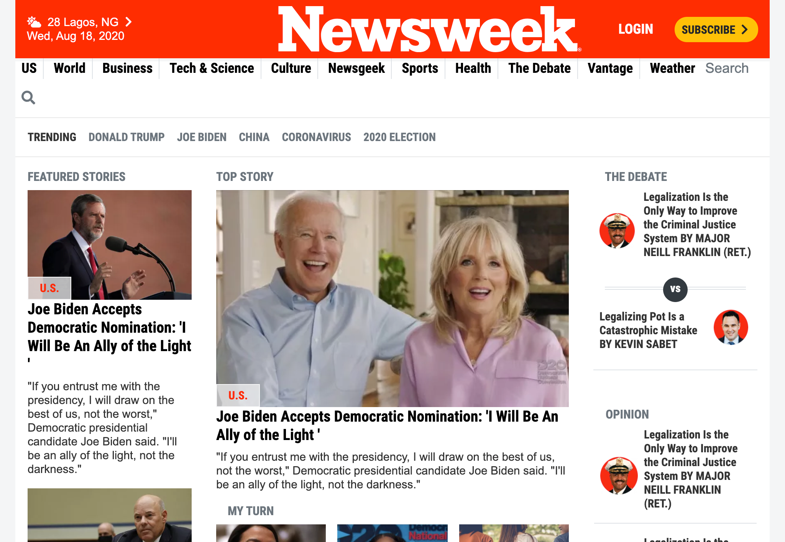

# Newsweek Landing Page

> This project focusses on cloning the current landing page of Newsweek.   
The main goal of the project is to practice our knowledge of Twitter Bootstrap in creating a responsive website.

The newsweek website has different sections that appear differently in dynamic positions on the three major screen sizes; Mobile, Tablet and Desktop screens.

The sections below were covered in this project:
- Navbar
- Featured Stories
- Top Story
- The Debate
- My Turn
- Culture & Travel
- More Stories
- Opinion
- Several Ads
- In the Magazine
- Editor's Pick
- Various Focus Categories (US, World, Sports...)
- Subscribe
- Newsletter
- Footer

## Built With

- HTML/CSS3,
- Twitter Bootstrap,
- Font Awesome

## Live Demo

[Live Demo Link](https://livedemo.com)

## Getting Started

Follow the instructions below to get a working copy of this clone.

### Prerequisites
A working knowledge of the technologies used: HTML, CSS3 and Bootstrap

### Setup
Clone this repo to your local machine
`git clone https://github.com/Adewunmi97/Newsweek-clone.git`

### Install
Install the Webhint and Stylelint linters

### Usage
Go through the code, study and edit as desired

### Deployment
Feel free to deploy using any medium of choice

## Authors

👤 **Adewunmi**

- Github: [@Adewunmi97](https://github.com/Adewunmi97)

👤 **Damilola**

- Github: [@oracleot](https://github.com/oracleot)

## 🤝 Contributing

Contributions, issues and feature requests are welcome!

Feel free to check the [issues page](issues/).

## Show your support

Give a ⭐️ if you like this project!

## 📝 License

This project is [MIT](lic.url) licensed.
